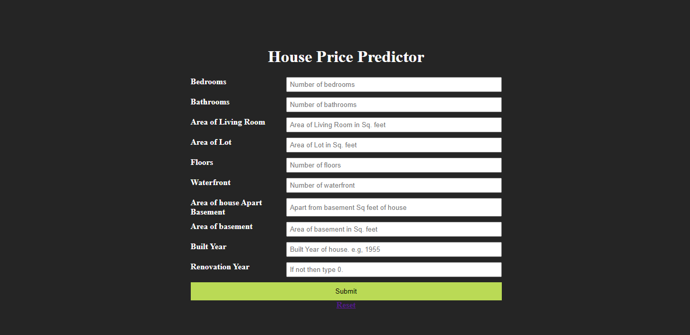

# house-price-prediction-advanced-regression
The "house-price-prediction-advanced-regression" repository contains code and resources for a powerful model that predicts house prices. It considers factors like bedrooms, bathrooms, and living area. With simple instructions, it's a valuable tool for accurately estimating house prices using advanced regression techniques.

# ***Website Layout***

## Algorithmic Techniques

Linear Regression	

ElasticNet	

Gradient Boosting Regressor	

XGBRegressor	

Random Forest Regressor	

DecisionTreeRegressor

